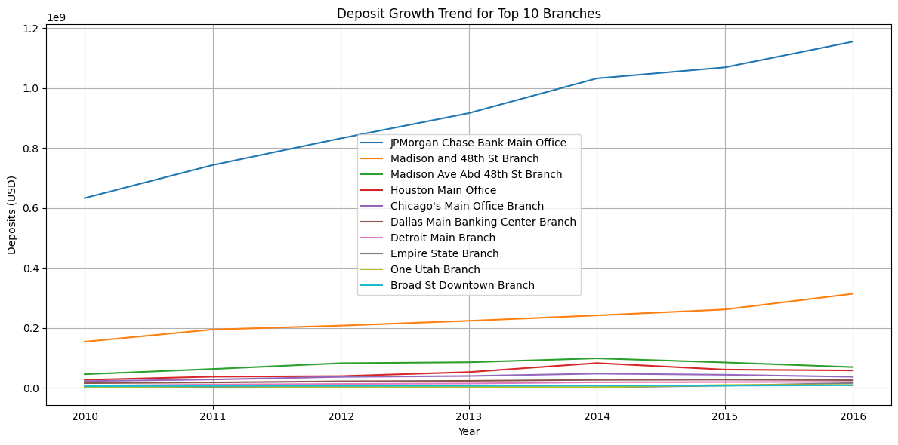
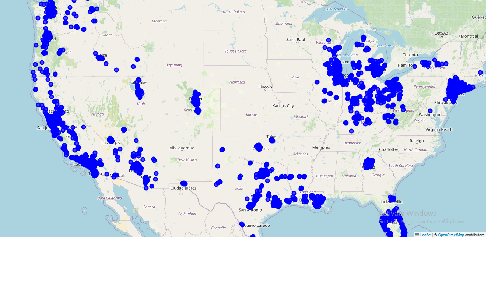

# Chase Bank Branch Performance and Efficiency Analysis

## Overview
This project analyzes the performance and efficiency of Chase Bank branches across the United States. The dataset includes branch details, location data, and deposit records from 2010 to 2016. The goal is to gain insights into branch growth, deposit distribution, and spatial trends.

## Dataset
The dataset includes:
- Branch name, number, and address
- City, state, and zip code
- Latitude and longitude
- Deposit amounts from 2010 to 2016
- Date of establishment and acquisition details (if applicable)

## Objectives
1. **Data Cleaning & Preparation**: Handle missing values and ensure data consistency.
2. **Branch Performance Analysis**:
   - Identify branches with the highest and lowest deposits.
   - Calculate deposit growth rates from 2010 to 2016.
3. **Geospatial Analysis**:
   - Visualize branch locations using Folium.
   - Identify regional deposit distribution.
4. **Data Visualization**:
   - Bar charts of top-performing branches.
   - Interactive maps showing deposit trends.

## Implementation
The analysis is conducted in Python using:
- **Pandas** for data manipulation
- **Matplotlib & Seaborn** for visualization
- **Folium** for geospatial mapping

### Key Steps:
1. Load the dataset and handle missing values.
2. Compute total deposits and deposit growth rates.
3. Identify top and bottom-performing branches.
4. Create a visualization of the top 10 branches by deposits.
5. Generate an interactive map of branch locations.

## Results
- The total deposits in 2016 are analyzed across all branches.
- The branch with the highest deposits and the fastest growth rate are identified.
- A geospatial map of branch locations is generated for further insights.
- 

Here is a Deposit Growth Trend for Top 10 Branches



Here is a chase_branch_map


## How to Run
1. Clone this repository:
   ```bash
   git clone https://github.com/yourusername/chase-bank-analysis.git
   ```
2. Install dependencies:
   ```bash
   pip install pandas matplotlib seaborn folium
   ```
3. Run the Python script:
   ```bash
   python chase_analysis.py
   ```
4. Open the generated map file:
   ```bash
   open chase_branch_map.html
   ```

## Files
- `database.csv`: The dataset containing Chase Bank branch data.
- `chase_analysis.py`: The Python script for analysis.
- `chase_branch_map.html`: Interactive map of branch locations.

## Conclusion
This project provides a data-driven approach to evaluating Chase Bank's branch performance, highlighting trends in deposit growth and regional distribution.
